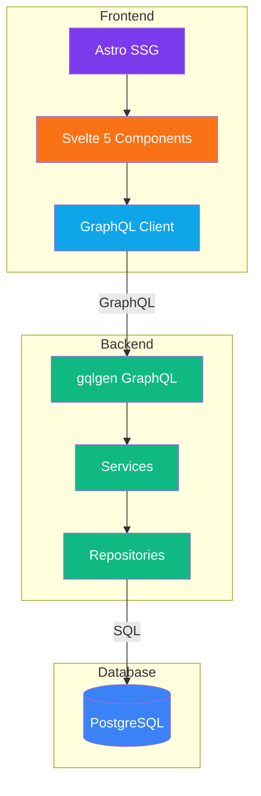
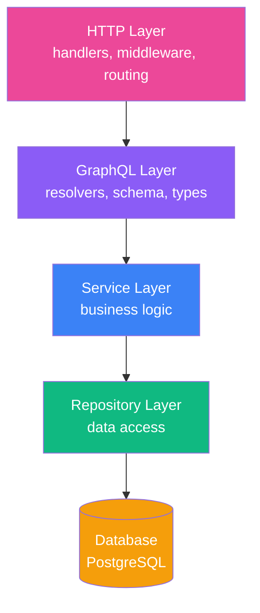
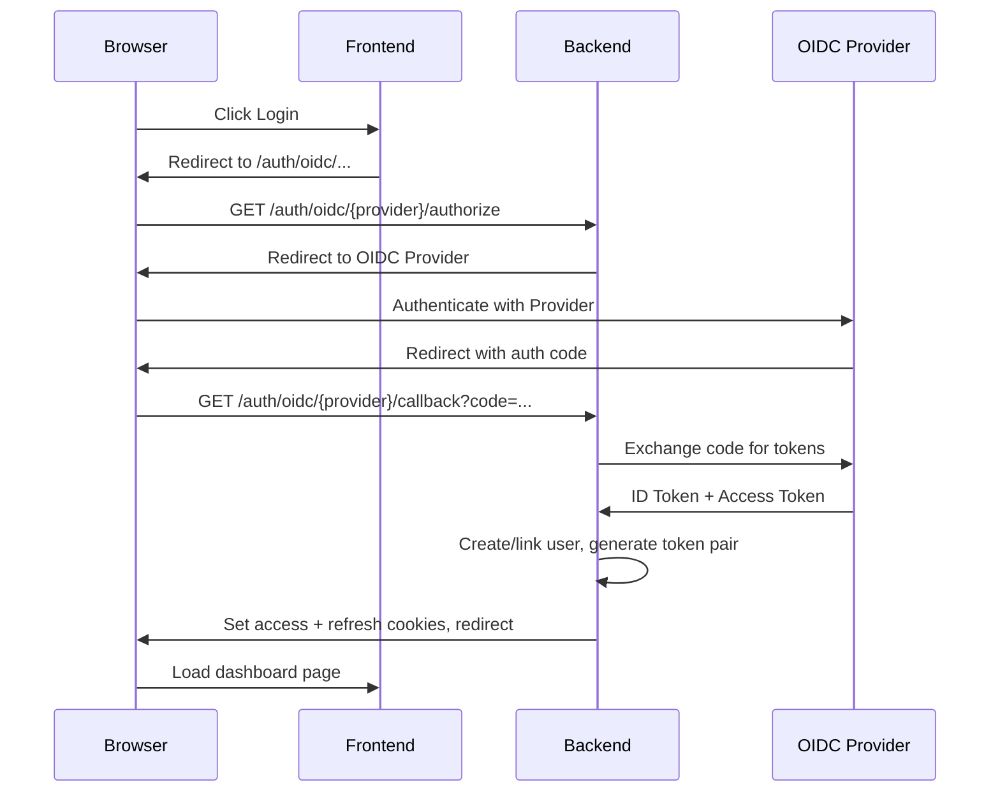
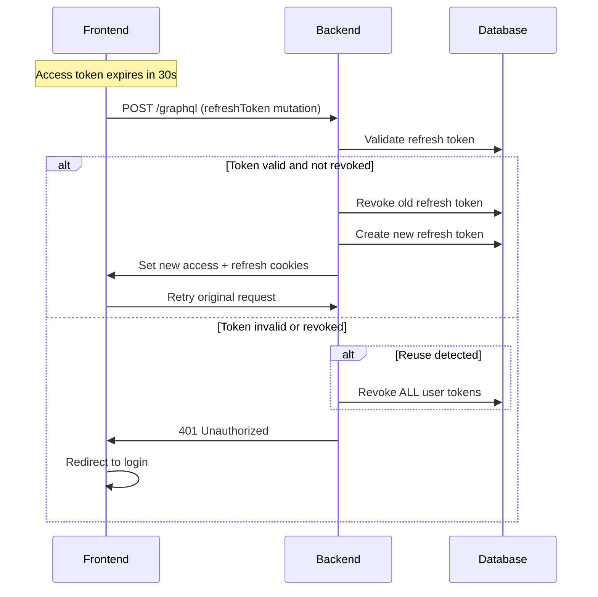
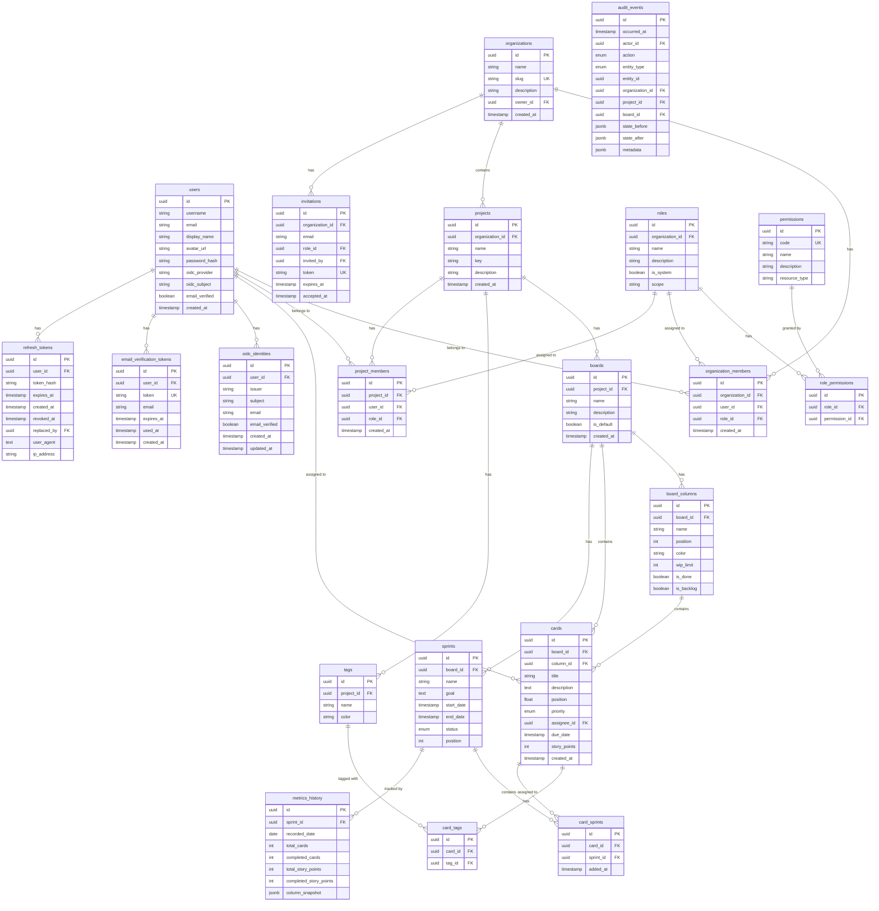

This document describes the technical architecture of Kaimu.

## Overview

Kaimu is built as a modern web application with a clear separation between frontend and backend:



## Frontend Architecture

### Technology Stack

- **Astro** - Static site generation with islands architecture
- **Svelte 5** - Reactive components with runes (`$state`, `$derived`, `$effect`)
- **TypeScript** - Type safety
- **Bits UI** - Accessible UI components

### Directory Structure

```
frontend/
├── src/
│   ├── components/     # Svelte components
│   ├── layouts/        # Astro layouts
│   ├── pages/          # Astro pages (file-based routing)
│   ├── lib/
│   │   ├── api/        # API client functions
│   │   └── graphql/    # GraphQL queries and generated types
│   └── styles/         # Global styles
├── astro.config.mjs
└── package.json
```

### Key Patterns

#### Islands Architecture

Astro renders pages as static HTML, with Svelte components hydrated as interactive "islands":

```astro
---
// src/pages/dashboard.astro
import Layout from '../layouts/Layout.astro';
import Dashboard from '../components/Dashboard.svelte';
---

<Layout>
  <Dashboard client:load />
</Layout>
```

#### Svelte 5 Runes

Components use Svelte 5's runes for state management:

```svelte
<script lang="ts">
  let count = $state(0);
  let doubled = $derived(count * 2);

  $effect(() => {
    console.log('Count changed:', count);
  });
</script>
```

## Backend Architecture

### Technology Stack

- **Go** - Compiled, performant backend
- **gqlgen** - Code-first GraphQL server
- **GORM** - Database ORM
- **PostgreSQL** - Relational database

### Directory Structure

```
backend/
├── cmd/
│   └── main.go           # Entry point
├── config/               # Configuration
├── graph/
│   ├── schema.graphqls   # GraphQL schema
│   ├── types.graphqls    # GraphQL types
│   ├── generated/        # Generated code
│   └── resolver.go       # Resolver dependency injection
├── internal/
│   ├── commands/         # CLI commands
│   ├── db/
│   │   └── repositories/ # Data access layer
│   ├── resolvers/        # GraphQL resolver implementations
│   └── services/         # Business logic
├── http/
│   ├── handlers/         # HTTP handlers
│   └── middleware/       # HTTP middleware
└── db/
    └── migrations/       # SQL migrations
```

### Layer Architecture



### Key Patterns

#### Dependency Injection

Services are injected into the GraphQL resolver:

```go
// graph/resolver.go
type Resolver struct {
    Config              config.Config
    AuthService         auth.Service
    OrganizationService organization.Service
    ProjectService      project.Service
    // ...
}
```

#### Repository Pattern

Data access is abstracted behind repository interfaces:

```go
// internal/db/repositories/user/user_repository.go
type Repository interface {
    Create(ctx context.Context, user *User) error
    GetByID(ctx context.Context, id uuid.UUID) (*User, error)
    GetByEmail(ctx context.Context, email string) (*User, error)
    Update(ctx context.Context, user *User) error
}
```

#### Service Pattern

Business logic lives in services:

```go
// internal/services/organization/organization_service.go
type Service interface {
    Create(ctx context.Context, name, description string, ownerID uuid.UUID) (*Organization, error)
    GetByID(ctx context.Context, id uuid.UUID) (*Organization, error)
    GetUserOrganizations(ctx context.Context, userID uuid.UUID) ([]*Organization, error)
}
```

## Authentication Flow

### OIDC Authentication



### Token Refresh Flow



## Database Schema

### Entity Relationships



## Code Generation

### GraphQL (Backend)

After modifying `graph/*.graphqls`:

```bash
cd backend
make gql
```

This generates:
- `graph/generated/generated.go` - Server code
- `graph/model/models_gen.go` - Go types

### GraphQL (Frontend)

After modifying `src/lib/graphql/*.graphql`:

```bash
cd frontend
bun run codegen
```

This generates:
- `src/lib/graphql/generated.ts` - TypeScript types and functions
