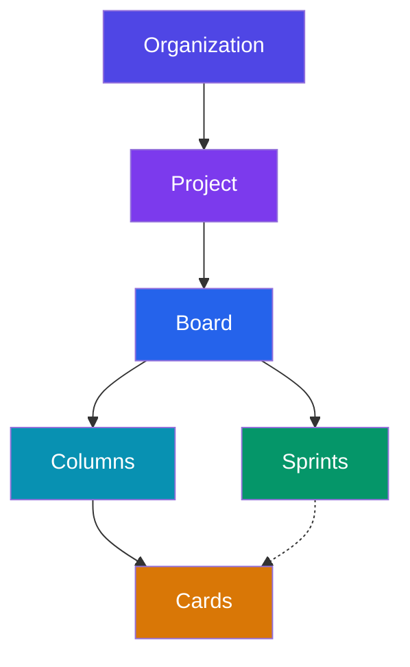

Kaimu helps software teams organize their work using a hierarchical structure of organizations, projects, boards, and cards. This guide explains how these concepts work together.

## Hierarchy Overview

## Organizations

**Organizations** are the top-level container in Kaimu. They represent a company, team, or group that shares projects and resources.

- Each organization has **members** with assigned roles (Owner, Admin, Member, Viewer)
- Organizations contain **projects** that group related work
- Users can belong to multiple organizations

[Learn more about Organizations →](/usage/organizations/)

## Projects

**Projects** live within an organization and contain related work. Think of them as the main unit for a product, service, or initiative.

- Each project has a **key** (e.g., "PROJ") used for card references
- Projects contain one or more **boards** for organizing work
- **Tags** are scoped to projects and can be used across all boards

## Boards

**Boards** visualize work using the Kanban methodology:

- **Columns**: Customizable workflow stages (Todo, In Progress, Review, Done)
- **Cards**: Work items that move through columns
- **Sprints**: Time-boxed iterations for agile workflows (optional)

[Learn more about Projects & Boards →](/usage/projects-boards/)

## Cards

**Cards** represent units of work:

- **Title & Description**: Rich text with markdown support
- **Priority**: None, Low, Medium, High, Urgent
- **Assignee**: Team member responsible
- **Due Date**: Optional deadline
- **Story Points**: Estimation for sprint planning
- **Tags**: Categorization labels
- **Sprints**: Can belong to multiple sprints

## Sprints

**Sprints** are time-boxed iterations for agile teams:

- **Status**: Future, Active, or Closed
- **Goal**: Sprint objective
- **Cards**: Work items planned for the sprint
- **Metrics**: Burndown charts, velocity tracking

[Learn more about Cards & Sprints →](/usage/cards-sprints/)

## Views

Kaimu provides multiple views for different workflows:

### Board View
Traditional Kanban board with drag-and-drop cards between columns. Best for daily work and visualizing flow.

### Planning View
Sprint planning interface showing:
- Active Sprint (expanded by default)
- Future Sprints (collapsed, expandable)
- Backlog (cards not in any sprint)
- Closed Sprints (historical reference)

### Metrics View
Sprint analytics including:
- Burndown/Burnup charts
- Cumulative flow diagram
- Sprint velocity

## Role-Based Access Control

Kaimu uses roles to control what users can do:

| Role | Description |
|------|-------------|
| **Owner** | Full access, cannot be removed from organization |
| **Admin** | Can manage organization and projects |
| **Member** | Can view and contribute to projects |
| **Viewer** | Read-only access |

Each role has specific permissions for organizations, projects, boards, and cards. Custom roles can also be created.

## Next Steps

- [Organizations](/usage/organizations/) - Managing organizations and members
- [Projects & Boards](/usage/projects-boards/) - Setting up your workflow
- [Cards & Sprints](/usage/cards-sprints/) - Tracking work with agile practices
